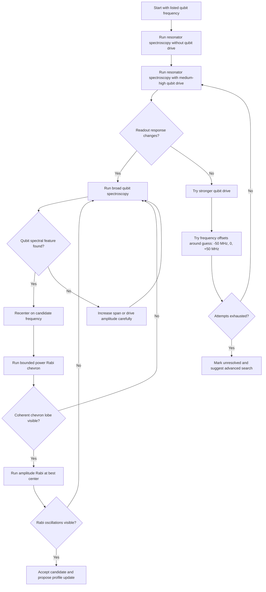

# Qubit Frequency Discovery Knowledge Graph

This note describes a decision graph for finding a qubit frequency when the
only trusted information is a rough frequency written in a list or profile. The
goal is not only to document the human procedure, but also to shape it into
something that can later be automated.

## Problem

Sometimes the stored qubit frequency is only a weak guess. If the qubit drive is
too high, it can excite a large part of the spectrum and hide the true feature.
If the drive is too low, the qubit may not be excited enough to produce a clear
signal. The search therefore needs to balance visibility and specificity.

The procedure should answer:

- Is the listed frequency close enough to the real qubit transition?
- Can the readout resonator see a difference when the qubit is driven?
- If not, should the next action be stronger drive, wider span, or a small
  frequency offset around the guess?
- When a candidate is found, is it real, repeatable, and not just a high-power
  artifact?

## Main Idea

Start with resonator spectroscopy while applying a medium-high qubit saturation
drive near the guessed qubit frequency. In this graph, the driven resonator scan
uses the qubit `saturation` operation. This is a cheap test for
state-dependent readout contrast.

If the resonator response changes when the qubit drive is applied, that means
the qubit drive is probably affecting the qubit. Use qubit spectroscopy only as
a coarse candidate generator. Do not run many repeated 1D qubit spectroscopy
scans. Once a plausible center exists, switch to a power Rabi chevron around the
candidate. The chevron is more useful because it shows frequency and drive
amplitude together, and it can reveal whether the candidate supports coherent
Rabi structure instead of only a fitted spectral peak.

If the resonator response does not change, do not immediately give up. Try a
small set of controlled variations:

- Increase the qubit drive amplitude.
- Shift the qubit drive frequency by about `+/- 50 MHz`.
- Repeat the resonator comparison.
- If still nothing changes, widen the search or mark the qubit as low
  confidence.

## Decision Graph



## Suggested Search Passes

| Stage | Experiment | Drive amplitude | Frequency span | Purpose |
| --- | --- | --- | --- | --- |
| 1 | Resonator spectroscopy, no qubit drive | None | Resonator span | Baseline resonator response |
| 2 | Resonator spectroscopy, with qubit drive | Medium-high | Qubit drive near listed frequency | Check whether qubit drive affects readout |
| 3 | Resonator comparison with offsets | Medium-high to high | Listed frequency `+/- 50 MHz` | Recover from a bad listed frequency |
| 4 | Broad qubit spectroscopy | Medium | Large span | Find a candidate qubit transition |
| 5 | Power Rabi chevron | Medium amplitude range | Candidate center, bounded 2D sweep | Validate frequency and useful drive amplitude together |
| 6 | Amplitude Rabi validation | Medium to medium-low | Best chevron center | Check for coherent oscillations |
| 7 | Ramsey, after rough pi exists | Calibrated rough pi | Small detuning span | Refine frequency only after the candidate behaves like `f01` |

## Practical Rules

Keep active reset off until readout is trusted. For early discovery, always use
thermal reset, raw `I/Q` readout, and no threshold-based state discrimination.
At this stage the qubit frequency, readout threshold, integration-weight angle,
and pi pulse may all be uncertain, so feedback-based reset can prepare the wrong
state and confuse the spectrum.

```python
parameters.reset_type = "thermal"
parameters.use_state_discrimination = False
```

For the resonator spectroscopy branch, use saturation as the qubit operation:

```python
parameters.qubit_operation = "saturation"
```

Use 200 sweep points for both resonator spectroscopy and qubit spectroscopy.
Choose the frequency step from the span:

```python
parameters.frequency_step_in_mhz = parameters.frequency_span_in_mhz / 200
```

Do not use `1000` averages during this discovery graph. Keep the early scans
fast enough to iterate, and spend extra time only after a candidate has survived
the spectroscopy and Rabi checks.

Use high drive only as a search tool. A strong qubit drive can make the feature
visible, but it can also broaden the line, shift the apparent center, or excite
unwanted transitions.

Use low drive only after the search is already centered. A weak drive gives a
cleaner spectrum, but if the initial frequency is wrong it may produce no
visible signal.

Do not trust a feature at the edge of a scan. Recenter the scan and repeat.

Do not update the profile from a single high-power scan. First confirm the
candidate with a power Rabi chevron and, if possible, an amplitude Rabi.

Prefer a bounded power Rabi chevron over many repeated qubit spectroscopy
runs. A good discovery chevron should sweep frequency and amplitude, but it
should still be intentionally small:

```python
parameters.reset_type = "thermal"
parameters.use_state_discrimination = False
parameters.operation = "x180"
parameters.frequency_span_in_mhz = 80  # to 120 for early validation
parameters.frequency_step_in_mhz = parameters.frequency_span_in_mhz / 80
parameters.min_amp_factor = 0.0
parameters.max_amp_factor = 1.2
parameters.amp_factor_step = 0.04
parameters.num_shots = 150  # to 250, not 1000
```

Use a wider chevron only if the candidate is still uncertain. If the chevron
shows a clear lobe, use its best center for amplitude Rabi and later Ramsey.

When reading the power Rabi chevron for this discovery graph, treat the
rightmost clear peak or dip as the `f10` candidate. Lower-frequency structures
can be `f12`, two-photon response, leakage, or other driven features. The sign
does not matter here: depending on the measured quadrature and readout
projection, the useful feature can appear as either a peak or a dip.

After the rightmost clear feature is identified, zoom in around it instead of
continuing broad spectroscopy. In the zoomed chevron, reduce the drive
amplitude linearly across follow-up runs to improve the qubit-frequency
resolution:

```text
run broad chevron
choose rightmost clear peak_or_dip as f10_candidate
for amp_max in [1.2, 0.9, 0.6, 0.4]:
    run narrower chevron centered on f10_candidate
    keep thermal reset and state discrimination off
    update f10_candidate from the cleanest rightmost feature
```

The goal of lowering amplitude is to reduce power broadening and avoid lighting
up unwanted transitions while keeping enough contrast to see the feature.

The Gaussian fit used for spectroscopy may need either positive or negative
amplitude. Depending on the measured quadrature, readout angle, background, and
which signal projection is analyzed, the real transition can look like a peak or
a dip. Automation should fit or score both signs and should not reject a
candidate only because the fitted amplitude has the opposite sign.

Validate that the found peak is really the `f01` transition. Qubit
spectroscopy can find the wrong spectral feature, especially when the drive is
strong or the stored frequency is poor. Possible false candidates include:

- The `f12` transition.
- A two-photon transition near `f01 - alpha / 2`.
- Mixer image-sideband excitation.
- LO leakage or another hardware spur.
- A transition from another nearby qubit.

Here `alpha` is the qubit anharmonicity. If the candidate is close to one of
these expected false-transition frequencies, mark it as suspicious and require
independent validation before updating the profile.

Good validation checks include:

- Run a power Rabi chevron around the candidate and check for a coherent
  frequency-amplitude lobe.
- Prefer the rightmost clear chevron peak or dip as the `f10` candidate, then
  zoom in and lower amplitude linearly to improve frequency resolution.
- Run an amplitude Rabi at the candidate and verify coherent oscillations are
  visible. Use thermal reset and keep state discrimination off for this early
  validation, just like spectroscopy.
- Run Ramsey after a rough pi pulse exists and confirm the frequency correction
  is small and sensible.
- Check that the same candidate improves readout contrast or IQ separation.
- Check that the candidate is not better explained by `f12`, `f01 - alpha / 2`,
  image sideband, or another qubit.

Prefer a loop that changes one thing at a time:

1. Frequency center.
2. Frequency span.
3. Drive amplitude.
4. Number of shots or averaging.

## Automation Signals

An automated routine should extract these measurements from each run:

- Contrast between resonator scans with and without qubit drive.
- Peak depth or height in qubit spectroscopy.
- Signal-to-noise ratio of the fitted feature.
- Whether the peak is near the scan edge.
- Fit quality and linewidth.
- Chevron lobe visibility, best frequency band, and whether oscillations vary
  smoothly with amplitude.
- The rightmost clear chevron peak or dip, marked as the preferred `f10`
  candidate.
- Frequency shift after each zoomed chevron while maximum amplitude is reduced
  linearly.
- Repeatability across two nearby amplitudes or spans.
- Whether the candidate frequency is physically plausible for the device.
- Whether the run used thermal reset and raw `I/Q` readout. For this graph,
  active reset and state discrimination should be treated as disabled.
- Distance from expected false-transition locations such as `f12`,
  `f01 - alpha / 2`, image sidebands, and known neighboring-qubit frequencies.

Each automation run should also publish a human-browsable artifact folder under
`knowledge_graphs/automation_data/<qubit>/frequency_discovery/`. Save the run
summary as `record.json` and copy any saved calibration figures into a
`figures/` subfolder. The JSONL log is useful for scripts, but the artifact
folder is what the user should open to inspect what was found.

Each node in the graph can return an outcome:

- `found`: a candidate was found with enough confidence.
- `weak_found`: a feature exists, but needs confirmation.
- `not_found`: no clear feature.
- `edge_found`: feature is probably outside or near the edge of the scan.
- `ambiguous`: several features or too much background response.
- `unsafe`: drive or readout settings look too aggressive.

## Advanced Ideas

### 1. Bayesian Frequency Search

Keep a probability distribution over possible qubit frequencies instead of a
single guess. Each resonator comparison or qubit spectroscopy scan updates the
probability map. The next scan is chosen where it is expected to reduce the
uncertainty the most.

This is useful when the qubit may be far from the stored frequency or when scans
are expensive.

### 2. Multi-Resolution Search

Use a coarse scan first, then split promising regions into finer scans. This is
similar to zooming into a map:

- Coarse step: find possible regions.
- Medium step: reject false positives.
- Fine step: estimate the center accurately.

The automation should not spend many points in regions that already look empty.

### 3. Adaptive Drive Amplitude

Treat drive amplitude as a control variable. If no feature is visible, increase
the amplitude. If too much of the spectrum lights up, decrease the amplitude.

A simple controller could use:

```text
if no_feature:
    increase_amplitude()
elif too_broad_or_many_features:
    decrease_amplitude()
elif clear_feature:
    narrow_span_and_confirm()
```

### 4. Resonator-First Classifier

Before running full qubit spectroscopy, train a small classifier on resonator
spectroscopy pairs:

- Input: resonator trace without qubit drive.
- Input: resonator trace with qubit drive.
- Output: likely qubit affected or not affected.

This can cheaply decide whether the qubit drive is doing anything.

### 5. Confidence Score For Profile Updates

Never update the profile just because a fit returned a number. Attach a
confidence score to every proposed qubit frequency:

```text
confidence = repeatability_score
           + centered_peak_score
           + fit_quality_score
           + readout_contrast_score
           - edge_penalty
           - excessive_linewidth_penalty
```

Only apply updates automatically above a chosen threshold. Below that threshold,
save the proposal and ask for review.

### 6. Knowledge Graph Nodes

Represent the calibration procedure as nodes and edges:

- Node: `listed_qubit_frequency`
- Node: `resonator_baseline`
- Node: `resonator_with_qubit_drive`
- Node: `readout_difference_detected`
- Node: `broad_qubit_spectroscopy`
- Node: `candidate_qubit_frequency`
- Node: `power_rabi_chevron_validation`
- Node: `profile_update_proposal`

Edges can carry conditions:

- `if contrast > threshold`
- `if peak near edge`
- `if no feature after max attempts`
- `if confidence > update_threshold`

This makes the procedure readable by both humans and automation code.

## Minimal Pseudocode

```python
candidate_centers = [
    listed_frequency_hz - 50e6,
    listed_frequency_hz,
    listed_frequency_hz + 50e6,
]

for center in candidate_centers:
    baseline = run_resonator_spectroscopy(qubit_drive=None)
    driven = run_resonator_spectroscopy(
        qubit_drive_frequency_hz=center,
        qubit_drive_amplitude="medium_high",
    )

    contrast = compare_resonator_traces(baseline, driven)
    if contrast < contrast_threshold:
        continue

    broad_scan = run_qubit_spectroscopy(
        center_frequency_hz=center,
        span_hz=large_span_hz,
        drive_amplitude="medium",
    )

    feature = analyze_qubit_spectrum(broad_scan)
    if not feature.found:
        continue

    chevron = run_power_rabi_chevron(
        center_frequency_hz=feature.center_hz,
        span_hz=bounded_span_hz,
        amp_range=(0.0, 1.2),
        reset_type="thermal",
        use_state_discrimination=False,
    )

    if not coherent_chevron_lobe_found(chevron):
        continue

    rabi = run_amplitude_rabi(
        qubit_frequency_hz=chevron.best_center_hz,
        reset_type="thermal",
        use_state_discrimination=False,
        averages="less_than_1000",
    )

    confidence = score_candidate(feature, chevron, rabi, contrast)
    if confidence > update_threshold:
        propose_profile_update("qubit_frequency_hz", chevron.best_center_hz)
        break
else:
    mark_qubit_unresolved()
```

## Open Questions To Improve This Graph

- What is a good numerical threshold for resonator trace difference?
- How many frequency offsets should be tried before switching strategy?
- Should the first qubit spectroscopy span be symmetric around the listed
  frequency or biased toward the expected device band?
- Which previous calibration results should be reused as priors?
- How should the automation detect false features from leakage, harmonics, or
  other qubits?

## Next Knowledge Graphs To Add

- Resonator frequency discovery from a cold start.
- Readout amplitude and integration weight optimization.
- Rabi amplitude discovery after qubit frequency is known.
- Ramsey detuning and frequency correction.
- Active reset readiness check.
- Full bring-up graph from empty profile to first usable gates.
